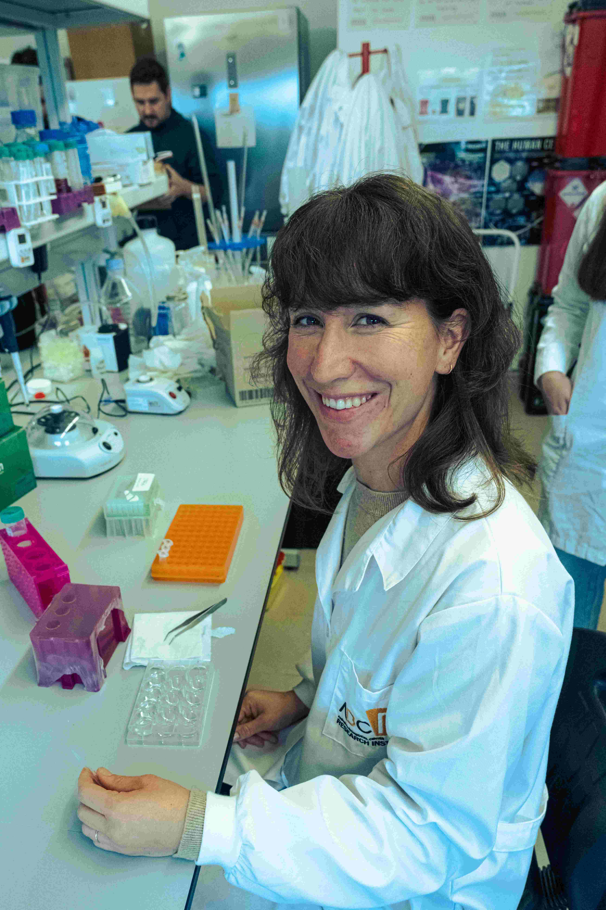

{: .align-left width="250"}

## About Me

I developed a passion for bridging the gap between mental and physical health research during my studies at Maastricht University and Karolinska Institutet. This interest led me to specialize in neuroimmunology, focusing on how immune responses affect the brain in conditions such as psychosis and neurodevelopmental disorders.

For my Ph.D., I investigated immune markers in psychosis, gaining expertise in antibody detection methods. I continued this research in the Netherlands and Spain, studying how immune system changes influence brain health. Currently, at the University of Algarve, I lead research on the role of immune proteins, particularly the complement system, in psychiatric disorders. Advances in genetics and organoid technology drive my efforts to uncover the biological basis of these conditions.

With 15 scientific articles, international conference presentations, and extensive experience in organizing scientific events, I am dedicated to advancing research in psychoneuroimmunology in collaboration with my colleagues at ABC-Ri.

For more information, see my complete CV [here](https://www.cienciavitae.pt/211F-792C-1B73).

---

### Research Interests
- **Neuroimmunology** – The role of the immune system in brain function and psychiatric disorders.
- **Psychoneuroimmunology** – How stress and immune activation impact mental health.
- **Organoid Technology** – Studying neurodevelopment with iPSC-derived brain organoids.
- **Complement System** – Investigating immune proteins in psychiatric conditions.

---

### Contact
📍 University of Algarve, ABC-Ri  
📧 cchoffmann@ualg.pt 
🔗 [LinkedIn](https://www.linkedin.com/in/carolin-hoffmann-27381851/)

